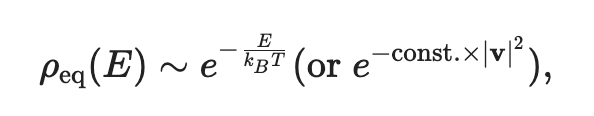
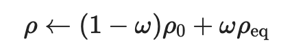
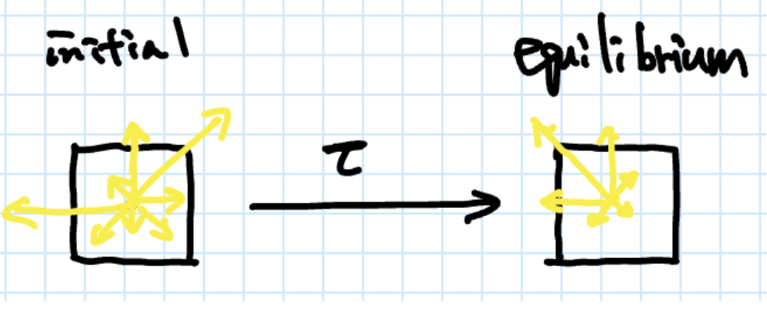
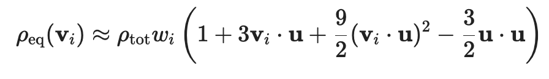

* fluid dynamics simulation
* lbm
the movement of particles
state(i,j)==rou_ij(v)
velocity

the energy of the particles is governed by the Boltzmann distribution
kb,t,e

* d2q9
lbm, a discrete set of velocities
the simplest model,
** a 2D lattice
** 9 discrete velocities

2 steps:
1. streaming,move to neighboring cells
2. collision,exchange momentum

* streaming

* collision-bgk model
a simplifier version of th boltzmann equation.

$\tau$:

conserves: total density and omentum

* julia implementation
** step123
** step4
bgk
The equilibrium density is completely determined by the total density and the momentum of the fluid:

wi~e^{-|vi|^2}, the distribution of velocities with mean-velocity zero
